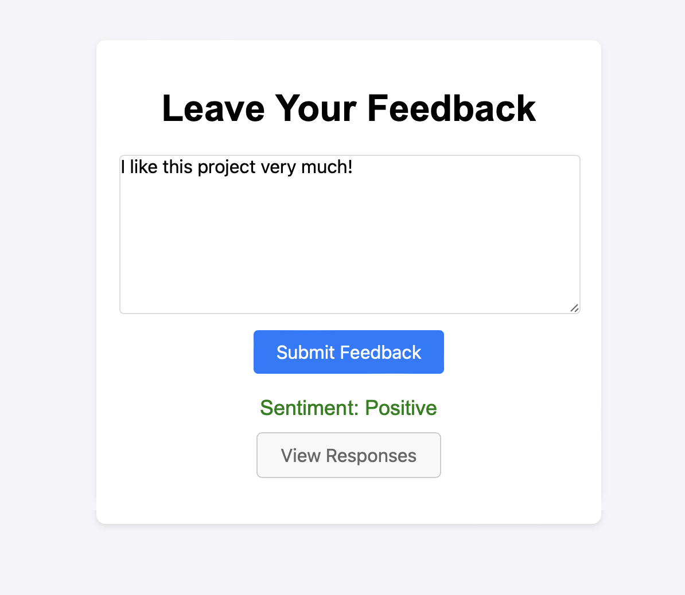
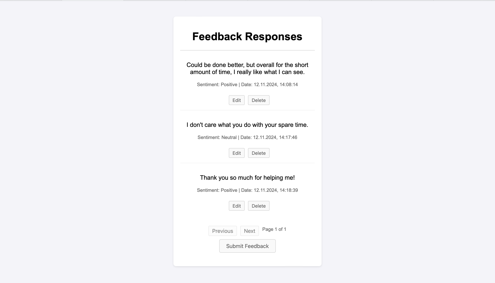

# Feedback Sentiment Analysis Web App

This project is a simple web application that allows users to submit feedback, which is analyzed for sentiment using OpenAI's GPT-3.5 API. The feedback entries are stored in a PostgreSQL database, and users can view, edit, or delete previous feedback entries.

Feedback mask             |  Submitted analyzed feedback
:-------------------------:|:-------------------------:
 |  

**Responses Overview and delete/ edit options**


## Features

- **Submit Feedback**: Users can submit their feedback text, which is analyzed for sentiment (Positive, Neutral, or Negative) using the OpenAI API.
- **View Responses**: All submitted feedback is displayed with the sentiment and timestamp.
- **Pagination**: The feedback list is paginated, showing 5 entries per page.
- **Edit Feedback**: Users can edit any feedback entry.
- **Delete Feedback**: Users can delete any feedback entry.
- **Responsive Design**: The app is designed to be responsive and user-friendly, with a simple UI for interaction.

## Tech Stack

- **Backend**:
  - **FastAPI**: For building the API and handling HTTP requests.
  - **PostgreSQL**: For storing feedback data.
  - **SQLAlchemy**: For interacting with the PostgreSQL database.
  - **OpenAI API**: For performing sentiment analysis on feedback.

- **Frontend**:
  - **HTML, CSS, JavaScript**: For building the user interface.
  - **Fetch API**: For making API calls from the frontend to the backend.

## Installation

### Prerequisites

- Python 3.10+
- Node.js (for frontend development)

### Backend Setup

1. Clone the repository:

    ```bash
    git clone https://github.com/maxpoe/python-feedback-app.git
    cd python-feedback-app
    ```

2. Install Python dependencies:

    ```bash
    pip install -r requirements.txt
    ```

3. Set up the PostgreSQL database and configure your connection in `database.py`.

4. Set up your OpenAI API key in the environment:

    ```bash
    export OPENAI_API_KEY="your-api-key"
    ```

5. Run the FastAPI app:

    ```bash
    uvicorn main:app --reload
    ```

6. The backend will be available at `http://localhost:8000`.

### Frontend Setup

1. Navigate to the `frontend` directory:

    ```bash
    cd frontend
    ```

2. Open the `index.html` in your browser, or serve them via a local server.

## Usage

- Go to `http://localhost:8000` (SwaggerUI) or open `index.html` to submit feedback.
- View the list of feedback and its sentiment on `responses.html`.
- You can edit or delete any feedback from the responses page.

## API Endpoints

- **POST /feedback**: Submit feedback (requires `feedback_text`).
- **GET /feedback**: Retrieve all feedback entries with sentiment and timestamp.
- **PUT /feedback/{id}**: Edit an existing feedback entry (requires `feedback_text`).
- **DELETE /feedback/{id}**: Delete a feedback entry.

## Room for expansion

Initially this small project started to get used to the tech stack. However, there are certain ideas, that potentially will come to life in the future:  

- User Authentication for accessing Responses page
- Creating a Docker container out of this project
- A Dashboard for visualiziing the sentiment analysis of the responses


## Contributing

Feel free to fork this repository and submit pull requests for any improvements or features you want to add. Please follow the existing code style.

## License

This project is licensed under the MIT License.
